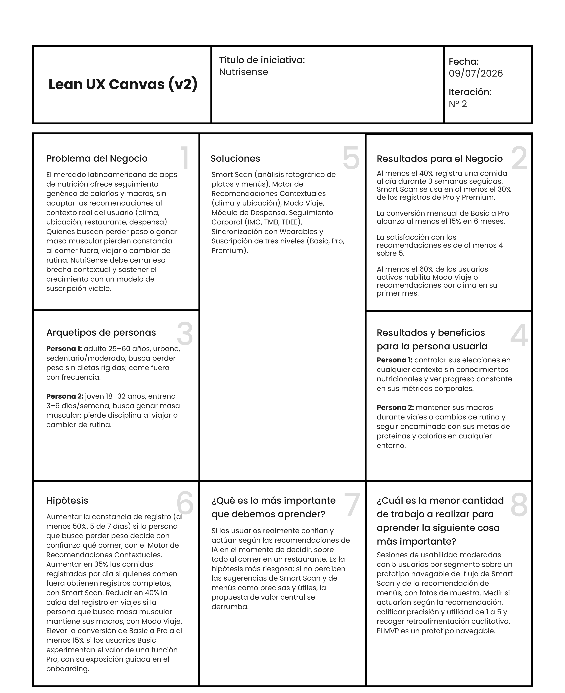

# CAPÍTULO I: INTRODUCCIÓN

## 1.1. Startup Profile

### 1.1.1. Descripción del Startup

NutriSense es una startup tecnológica enfocada en transformar la manera en que las personas gestionan su alimentación y alcanzan sus metas físicas. Nacimos para resolver uno de los retos más comunes en la vida cotidiana, tales como la dificultad de mantener una alimentación saludable y coherente con los objetivos personales en un entorno dinámico, donde los hábitos cambian según el clima, la ubicación y la disponibilidad de alimentos. Competimos en un mercado donde las soluciones existentes ofrecen un seguimiento genérico sin considerar el contexto real del usuario, y nos diferenciamos al integrar recomendaciones verdaderamente personalizadas basadas en datos ambientales, geográficos y del perfil individual de cada persona.
 Nuestra misión es empoderar a las personas para que tomen decisiones alimentarias más inteligentes mediante una plataforma web que combina el seguimiento nutricional, el análisis visual de alimentos y recomendaciones contextuales adaptadas al clima, la ubicación y los hábitos de cada usuario, contribuyendo así a una vida más saludable y sostenible.
 Nuestra visión es convertirnos en la plataforma de nutrición inteligente de referencia en América Latina, reconocida por ofrecer la experiencia más personalizada y contextual del mercado, capaz de acompañar a cada persona en su camino hacia sus metas físicas sin importar dónde se encuentre ni las circunstancias de su entorno.

### 1.1.2. Perfiles de integrantes del equipo

| Integrantes | Descripción |
| :--- | :--- |
|  | **Nombres y Apellidos:** Olenka Priscilla Del Aguila Del Aguila  **Código:** U202411669  **Carrera:** Ingeniería de Software  Soy una persona detallista y responsable, enfocada en la excelencia técnica y el cumplimiento de objetivos. Cuento con conocimientos en C++, Java, R y diseño de interfaces con Figma para crear prototipos funcionales. Me motiva el aprendizaje constante y el aporte de soluciones estéticas y funcionales, asegurando siempre un trabajo en equipo organizado, coherente y de alto impacto.|
|  | **Nombres y Apellidos:**  Angela Milagros Espinoza Cruz  **Código:** U202415495  **Carrera:** Ingeniería de Software  Soy una persona curiosa, creativa y resiliente, cualidades que me impulsan a aportar innovación en cada uno de mis trabajos. Cuento con conocimientos en Python, Figma y C++, además de experiencia en el diseño y desarrollo de páginas web. Me motiva el aprendizaje constante, la exploración de nuevas herramientas y la creación de soluciones innovadoras aplicadas a problemas existentes. Asimismo, considero que la proactividad y la comunicación asertiva son fundamentales para llevar a cabo los proyectos de manera efectiva.| 
|  | **Nombres y Apellidos:** Joel Fernando Mora Rivera  **Código:** U20241B227  **Carrera:** Ingeniería de Software  Soy una persona responsable, organizada y comprometida, con una actitud competitiva positiva que me impulsa a superar retos con constancia. Cuento con formación en C++, Python, Java y gestión de bases de datos relacionales y no relacionales, enfocándome en la innovación y optimización de procesos tecnológicos. Me apasiona el aprendizaje continuo y resolver desafíos técnicos que pongan a prueba mis habilidades. Además, priorizo el trabajo en equipo y la comunicación efectiva como motores fundamentales para alcanzar el éxito en cualquier proyecto. |
|  | **Nombres y Apellidos:** Rose Almendra Vergaray Calderon  **Código:** U20241D159  **Carrera:** Ingeniería de Software  Soy una persona responsable, creativa y detallista, cualidades que me impulsan a dar lo mejor de mí en cada proyecto. Cuento con conocimientos en Python, HTML, Java y un nivel intermedio en C++, además de experiencia en el diseño y programación de páginas web y en el manejo de bases de datos relacionales y no relacionales. Me motiva el aprendizaje constante, la exploración de nuevas herramientas y el desarrollo de soluciones innovadoras. Además, considero que el trabajo en equipo y la comunicación son esenciales para alcanzar metas y crecer tanto en lo personal como en lo profesional. |
|  |**Nombres y Apellidos:** Angel Martin Villarreal Bazan  **Código:** U202417857  **Carrera:** Ingeniería de Software Soy una persona proactiva y dedicada, enfocada en la mejora continua y el cumplimiento de objetivos. Cuento con sólidos conocimientos en C++ y Java, además de una fuerte base en lógica de programación para resolver problemas complejos. Me motiva el aprendizaje constante de nuevas tecnologías y el desafío de proyectos innovadores. Gracias a mi capacidad de organización y liderazgo, logro optimizar procesos y fomentar un entorno de trabajo colaborativo y eficiente.|

## 1.2. Solution Profile

### 1.2.1. Antecedentes y problemática
Aplicamos 5Ws y 2Hs, utilizado para examinar los antecedentes y la problemática que aborda nuestro proyecto.

| 5W / 2H | Pregunta | Descripcion|
| :--- | :--- | :--- |
|Who?|¿Quién es afectado?|Los principales afectados son dos grupos bien definidos. El primero son adultos que buscan perder peso sin seguir dietas rígidas, que comen frecuentemente fuera de casa y no tienen claridad sobre el valor nutricional real de lo que consumen. El segundo son jóvenes que practican ejercicio con regularidad y necesitan un control preciso de sus macronutrientes, especialmente proteínas, pero que ven interrumpida su disciplina nutricional cuando viajan o cuando su rutina cambia. De forma indirecta, también se ven involucrados profesionales de la salud que podrían recomendar la plataforma a sus pacientes.|
|What?|¿Cuál es el problema?|El problema central es la dificultad que enfrentan las personas para mantener un control nutricional efectivo y personalizado en su vida diaria. Las aplicaciones de nutrición actuales ofrecen un registro genérico de calorías y macros, pero no consideran el contexto real del usuario: el clima del día, el país o ciudad donde se encuentra, los ingredientes que tiene disponibles en casa, ni las restricciones médicas o alimentarias específicas de cada persona. Esto genera que el usuario registre lo que come, pero no reciba orientación útil sobre qué debería comer según su situación particular. Nuestra solución busca cerrar esa brecha ofreciendo recomendaciones verdaderamente contextuales y personalizadas para quienes quieren perder peso o ganar masa muscular.|
|When?|¿Cuándo sucede el problema?|Esto ocurre de forma cotidiana, especialmente en los momentos de decisión alimentaria: al elegir qué comer en un restaurante, al planificar las comidas del día, al viajar a una ciudad desconocida o al notar que el clima ha cambiado los hábitos de alimentación. El usuario recurre a la aplicación antes y durante las comidas, así como al final del día para revisar su progreso y planificar el día siguiente.|
|Where?|¿Dónde sucede el problema?|Surge en cualquier entorno donde el usuario deba tomar una decisión alimentaria sin información adecuada: en restaurantes, en la calle, en el trabajo, en casa o de viaje. La solución se accede desde cualquier dispositivo con navegador web, lo que permite acompañar al usuario en todos estos contextos sin necesidad de instalar nada adicional.|
|Why?|¿Cuál es la causa del problema?|La causa raíz del problema es la ausencia de herramientas que integren el contexto del usuario en las recomendaciones nutricionales. Las aplicaciones existentes como Fitia, MyFitnessPal o Cronometer permiten registrar alimentos, pero sus sugerencias no cambian según el clima, la ubicación geográfica ni los ingredientes disponibles en el hogar del usuario. Esto hace que la experiencia sea útil para el registro, pero limitada para la orientación real.|
|How?|¿Qué llevó a la persona a esta situación?|La implementación de NutriSense responde a la necesidad de simplificar la gestión nutricional mediante una plataforma SaaS que automatiza la toma de decisiones del usuario. El sistema procesa variables contextuales como el clima, la ubicación y la disponibilidad de ingredientes en el hogar, además de integrar el módulo Smart Scan para el reconocimiento de alimentos mediante visión artificial. Este modelo funcional se basa en la premisa de que la personalización extrema y la reducción del esfuerzo manual en el registro de datos son los factores determinantes para el éxito y la costumbre a largo plazo en programas de salud digital (Bernabel & Huatay, 2021).|
|How much?|¿Cuál es la cantidad, duración o intensidad del evento?|La magnitud del problema sanitario en el entorno local es crítica, ya que el sobrepeso y la obesidad alcanzan al 60.9% de los adultos en el Perú (Alsahli et al., 2023). Esta condición no es un evento aislado, sino una situación persistente que incrementa exponencialmente la probabilidad de padecer enfermedades crónicas no transmisibles, como la hipertensión y la diabetes tipo 2. La intensidad de esta problemática evidencia que la mayor parte de la población urbana enfrenta barreras estructurales para mantener hábitos saludables, lo que genera una carga epidemiológica que requiere soluciones tecnológicas de intervención inmediata (Lopez & Serrano, 2023). Por otro lado, la intensidad de la demanda en el sector digital refleja una oportunidad de mercado sólida y en crecimiento constante. Existe una disposición real por parte de los usuarios peruanos para adoptar y pagar por aplicaciones de salud que ofrezcan propuestas de valor diferenciadas y personalizadas. Este interés del consumidor post-pandemia indica que el mercado no solo busca herramientas de monitoreo, sino soluciones integrales bajo modelos de suscripción que garanticen una mejora tangible en la gestión de su bienestar personal (Alsahli et al., 2023).|

### 1.2.2. Lean UX Process

#### 1.2.2.1. Lean UX Problem Statements

El estado actual del seguimiento nutricional digital en el mercado latinoamericano se ha centrado principalmente en el conteo genérico de calorías y macronutrientes, dirigido a personas que buscan perder peso o ganar masa muscular, bajo el supuesto de que el usuario dispone de tiempo, conocimiento y un entorno alimentario estable para registrar e interpretar esos datos.

Lo que las soluciones existentes (Fitia, MyFitnessPal, Cronometer) no resuelven es el contexto real de la decisión alimentaria: no adaptan sus recomendaciones al clima, la ubicación, los platos disponibles en un restaurante ni a los ingredientes que el usuario tiene en casa. Esto es relevante en un mercado donde el sobrepeso y la obesidad afectan al 60.9 % de los adultos en el Perú y donde, tras la pandemia, existe una disposición creciente a pagar por aplicaciones de salud con propuestas de valor personalizadas. El resultado es que los usuarios registran lo que comen, pero no reciben orientación accionable sobre qué comer según su situación, y pierden la constancia justo cuando comen fuera de casa o cambian de entorno.

Nuestro producto abordará esta brecha entregando orientación alimentaria contextual y personalizada, que traduzca el perfil, las restricciones y el entorno del usuario en decisiones concretas con el mínimo esfuerzo de registro, sostenida por un modelo de suscripción viable.

Nuestro enfoque inicial serán los adultos urbanos del Perú de 18 a 60 años con interés activo en mejorar su condición física: quienes buscan perder peso (25–60 años) y quienes buscan ganar masa muscular (18–32 años).

Sabremos que tuvimos éxito cuando al menos el 40 % de los usuarios registrados registre una comida al día durante tres semanas consecutivas, la conversión mensual de Basic a Pro alcance ≥ 15 % en seis meses y la satisfacción con la relevancia de las recomendaciones promedie ≥ 4/5.

¿Cómo podríamos ayudar a estos usuarios a tomar decisiones alimentarias informadas y personalizadas en cualquier contexto, sin exigirles un esfuerzo significativo ni conocimientos nutricionales?

#### 1.2.2.2. Lean UX Assumptions

**1) Business Assumptions**

a) Creemos que nuestros usuarios necesitan tomar decisiones alimentarias inteligentes en tiempo real, sobre todo al comer fuera de casa, sin requerir conocimientos nutricionales. 
b) Estas necesidades pueden resolverse con recomendaciones contextuales y con el escaneo de alimentos, eliminando la estimación manual de calorías. 
c) Nuestros clientes iniciales son adultos de 18 a 60 años (unión de ambos segmentos) que viven en zonas urbanas del Perú y tienen interés activo en mejorar su condición física. 
d) El mayor valor que espera el cliente es recibir recomendaciones realmente relevantes para su situación actual: ubicación, clima y disponibilidad de alimentos. 
e) Los clientes también obtienen beneficios adicionales: seguimiento constante de macronutrientes, mejor visibilidad de su composición corporal y menor esfuerzo de planificación diaria. 
f) Adquiriremos a la mayoría de clientes mediante contenido en redes sociales (Instagram, TikTok) dirigido a comunidades de fitness, y mediante el boca a boca de los primeros usuarios con resultados visibles. 
g) Generaremos ingresos con un modelo de suscripción de tres niveles (Basic, Pro y Premium), sin nivel gratuito permanente. 
h) Nuestra principal competencia será Fitia, MyFitnessPal y Cronometer, que ofrecen seguimiento sin recomendaciones contextuales. 
i) Los superaremos porque ninguno combina recomendaciones por clima, modo viaje, análisis de menús y sugerencias basadas en la despensa en una única plataforma web. 
j) Nuestros mayores riesgos de producto son la baja confianza inicial en las recomendaciones de IA, la dependencia de APIs de terceros y construir una base de datos de alimentos amplia y localmente relevante. 
k) Resolveremos estos riesgos con explicaciones transparentes de cada recomendación, ingreso manual como alternativa e integración prioritaria con Open Food Facts.

**2) Business Outcomes**

- **Registran comidas a diario:** ≥ 40 % de los usuarios registrados registra ≥ 1 comida/día durante 3 semanas consecutivas.
- **Adoptan Smart Scan:** la función se usa en ≥ 30 % de todos los registros de comidas entre suscriptores Pro y Premium.
- **Convierten de Basic a Pro:** tasa de conversión mensual ≥ 15 % dentro de los primeros seis meses.
- **Valoran las recomendaciones:** satisfacción con su relevancia ≥ 4/5 en encuestas posteriores a la sesión.
- **Activan funciones contextuales:** ≥ 60 % de los usuarios activos habilita Modo Viaje o recomendaciones por clima en su primer mes.

**3) User Personas (Arquetipos de personas)**

- **Persona 1, Adulto que busca perder peso.** 25 a 60 años, urbano, sedentario o moderadamente activo. Come con frecuencia fuera de casa. Su necesidad es controlar su ingesta sin dietas rígidas; su obstáculo es no saber qué consume realmente al comer fuera y no recibir orientación según su contexto.
- **Persona 2, Joven que busca ganar masa muscular.** 18 a 32 años, urbano, entrena de 3 a 6 días por semana. Su necesidad es un seguimiento preciso de macronutrientes; su obstáculo es perder la disciplina nutricional al viajar o cuando cambia su rutina y su entorno alimentario habitual.

**4) User Outcomes & Benefits**

- **Persona 1:** quiere sentir que controla sus elecciones alimentarias sin el estrés de contar cada caloría. La motiva decidir mejor en restaurantes y en su rutina diaria sin volverse experta en nutrición. Sabrá que lo logró cuando elija con confianza qué comer en cualquier contexto y vea progreso constante en sus métricas corporales.
- **Persona 2:** quiere mantener la disciplina de macronutrientes aun cuando su rutina cambia por viajes, eventos o clima. La motiva no perder el progreso durante esos periodos. Sabrá que lo logró cuando se mantenga encaminada con sus objetivos de proteínas y calorías sin importar dónde esté.

**5) Features (Soluciones)**

- **Smart Scan:** análisis fotográfico de platos y menús (Google Cloud Vision API) con estimaciones nutricionales instantáneas.
- **Motor de Recomendaciones Contextuales:** sugerencias adaptadas en tiempo real al clima (OpenWeatherMap API), la ubicación y las restricciones dietéticas activas.
- **Modo Viaje:** detección de ciudad/país para sugerir platos locales saludables compatibles con el perfil.
- **Módulo de Despensa:** recetas y combinaciones a partir de los ingredientes disponibles en casa y el déficit diario de macros.
- **Seguimiento Corporal:** registro de peso y estatura con cálculo automático de IMC, TMB y TDEE, y meta calórica dinámica.
- **Sincronización con Wearables:** integración con Google Fit para importar pasos y calorías activas y ajustar el balance del día.
- **Dashboard y Analíticas:** progreso semanal, tendencia de peso, calorías diarias, dona de macros y rachas.
- **Suscripción de Tres Niveles:** Basic (seguimiento manual y dashboard), Pro (Smart Scan, Modo Viaje, recomendaciones por clima, wearables, despensa), Premium (análisis de menús, historial ilimitado, exportación PDF).

#### 1.2.2.3. Lean UX Hypothesis Statements

**Hypothesis Statement 1**

Creemos que **aumentar la constancia del registro nutricional diario —que al menos el 50 % de los adultos que buscan perder peso registre sus tres comidas principales en 5 de 7 días durante su segundo mes de uso—** se va a obtener si **los adultos de 25 a 60 años que comen con frecuencia fuera de casa** logran **decidir con confianza qué comer en cualquier contexto sin conocimientos nutricionales** con **el Motor de Recomendaciones Contextuales, que adapta las sugerencias a su clima y ubicación actuales**.

**Hypothesis Statement 2**

Creemos que **incrementar la completitud y precisión del registro —aumentar en al menos un 35 % el promedio de comidas registradas por día entre los usuarios Pro y Premium en los primeros 30 días, frente a su primera semana—** se va a obtener si **los usuarios que comen o piden comida fuera de casa** obtienen **registros nutricionales completos y precisos sin depender de la búsqueda manual** con **el módulo Smart Scan de análisis fotográfico de platos y menús**.

**Hypothesis Statement 3**

Creemos que **reducir en al menos un 40 % la caída de la finalización del registro diario durante los periodos de viaje, frente a la línea base previa a NutriSense,** se va a obtener si **los jóvenes de 18 a 32 años que entrenan con regularidad** logran **mantener su disciplina de macronutrientes cuando viajan** con **la función Modo Viaje, que sugiere platos locales saludables compatibles con su perfil nutricional activo**.

**Hypothesis Statement 4**

Creemos que **elevar la tasa de conversión mensual de Basic a Pro a ≥ 15 % dentro de los primeros seis meses tras el lanzamiento** se va a obtener si **los usuarios del nivel Basic** obtienen **una experiencia clara y de primera mano del valor de al menos una función Pro durante sus primeras dos semanas** con **la exposición guiada a una función Pro de alto valor (p. ej. Smart Scan) dentro del onboarding**.

#### 1.2.2.4. Lean UX Canvas

## 1.3. Segmentos Objetivo

### Segmento Objetivo 1: Personas que buscan perder peso

Nuestro primer segmento objetivo son adultos que tienen como meta la pérdida de peso y la mejora de sus hábitos alimentarios. Se trata de personas que buscan controlar su ingesta calórica de manera progresiva y sostenible, sin seguir planes dietéticos rígidos, y que necesitan orientación práctica en su vida cotidiana, especialmente cuando comen fuera de casa o se encuentran en entornos alimentarios poco familiares.

**Aspectos demográficos:**
- Sexo: Masculino y femenino
- Edades: 25 – 60 años
- Nivel socioeconómico: B y C (medio y medio-alto)

**Aspectos geográficos:**
- Nacionalidad: Peruana
  - Zona geográfica: Urbana
- Departamentos: Lima

**Aspectos psicográficos:**
- Valores: bienestar personal, salud preventiva, equilibrio entre vida social y hábitos saludables
- Estilos de vida: personas con rutinas laborales exigentes, que comen con frecuencia fuera de casa y disponen de tiempo limitado para planificar sus comidas
- Intereses: salud, bienestar, alimentación consciente, seguimiento de progreso físico
- Personalidad: motivados pero con dificultad para mantener la constancia; buscan soluciones prácticas que se adapten a su ritmo de vida sin requerir conocimientos nutricionales avanzados
- Frustraciones: no saber cuántas calorías consumen realmente al comer fuera, no recibir orientación relevante según su contexto, y sentir que las apps actuales son útiles para registrar pero no para decidir

### Segmento Objetivo 2: Personas que buscan ganar masa muscular

Nuestro segundo segmento objetivo son jóvenes adultos que practican ejercicio de forma regular y tienen como meta la ganancia de masa muscular. Su principal necesidad es el control preciso de macronutrientes, especialmente proteínas, y mantener su disciplina nutricional incluso cuando su entorno cambia por viajes, eventos sociales o variaciones climáticas.

**Aspectos demográficos:**
- Sexo: Masculino y femenino
- Edades: 18 – 32 años
- Nivel socioeconómico: B y C (medio y medio-alto)

**Aspectos geográficos:**
- Nacionalidad: Peruana
- Zona geográfica: Urbana
- Departamentos: Lima

**Aspectos psicográficos:**
- Valores: disciplina, rendimiento físico, constancia, superación personal
- Estilos de vida: activos, con rutinas de entrenamiento establecidas de 3 a 6 días por semana; usan habitualmente dispositivos tecnológicos como smartphones y smartwatches
- Intereses: fitness, nutrición deportiva, seguimiento de métricas corporales, tecnología aplicada al rendimiento
- Personalidad: metódicos y orientados a resultados; frustrados cuando su progreso se ve interrumpido por factores externos que no pueden controlar
- Frustraciones: perder el control de sus macros cuando viajan o cuando su rutina cambia, la dificultad de registrar comidas complejas en apps actuales, y la falta de sugerencias adaptadas a su contexto geográfico o climático